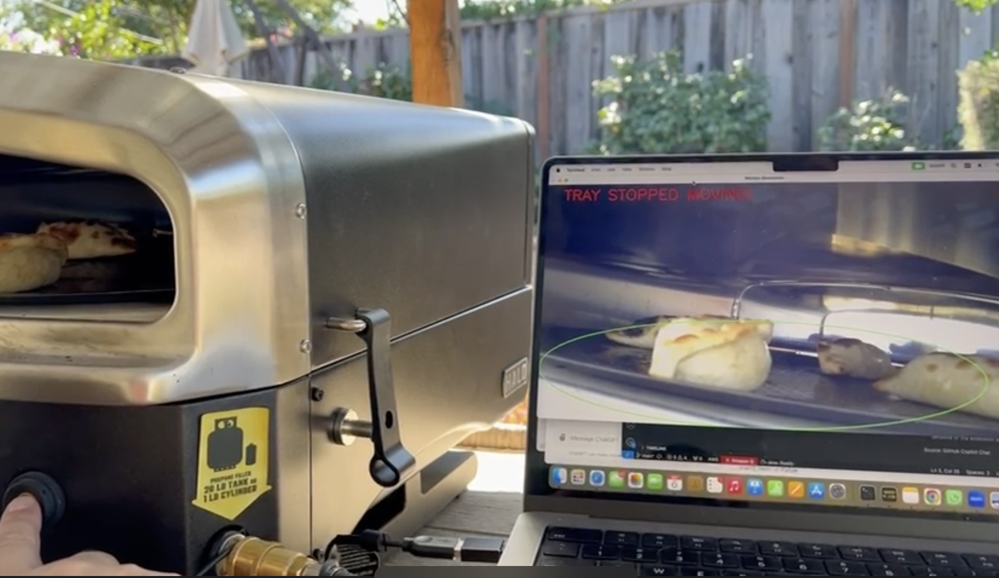

# README - Tray Movement Detection for Empanada Cooking

## Project Overview
This project aims to detect if a tray inside an oven is moving to ensure empanadas cook evenly. Using a Python script named `frameDiffWithROI.py`, the solution focuses on analyzing frames from a video feed to determine whether the tray is spinning as expected or if it has stopped, which could lead to uneven cooking.

## Requirements
- Python 3.x
- OpenCV (cv2)
- Numpy

You can install the required Python packages using the following command:
```bash
pip install opencv-python numpy
```

## Script Description: `frameDiffWithROI.py`
The main script, `frameDiffWithROI.py`, employs frame differencing with a region of interest (ROI) to monitor the tray's movement. Here's a breakdown of its components and functionality:

### Key Components
1. **Frame Differencing**: This technique compares the current frame with the previous one to detect motion.
2. **Region of Interest (ROI)**: The area of the frame where movement is expected (e.g., where the tray is visible).
3. **Movement Detection**: By checking the difference between frames within the ROI, the script determines if there is movement, indicating the tray is spinning.

### How It Works
- The video feed from the oven camera is processed frame by frame.
- A predefined region of interest (ROI) is used to focus on the tray area.
- Frame differencing is applied within the ROI to detect significant changes, signaling movement.
- If no movement is detected for a specified duration, an alert or log can be generated to notify that the tray has stopped spinning.

## Usage
1. **Set Up Camera Feed**
   Ensure the oven has a camera properly positioned to capture the tray. The feed should be clear, and the tray should be in the region of interest.

2. **Configure ROI**
   Modify the script to define the ROI that matches the position of the tray in the video feed. Adjust parameters as needed for your specific setup.

3. **Run the Script**
   Run the script as follows:
   ```bash
   python frameDiffWithROI.py
   ```

   The script will begin processing the video feed and provide output based on whether the tray is detected as moving or not.

## Customization
- **Thresholds**: You can adjust the thresholds for frame differencing to improve detection accuracy based on lighting conditions and tray speed.
- **Alerts**: Add functionality to trigger an alert (e.g., sound, email, or message) when the tray stops moving.

## Potential Improvements
- **Enhanced Detection**: Consider integrating optical flow for more robust movement detection.
- **Machine Learning**: A model could be trained to recognize tray movement patterns more accurately under different conditions.

## Example Use Case
In an empanada production line, it is crucial that the tray rotates to ensure all empanadas cook evenly. If the tray stops moving, the empanadas on one side may not cook properly, affecting product quality. This script helps monitor the movement and alerts staff if any issues arise.



## License
This project is licensed under the MIT License.

## Contact
For questions or suggestions, please contact [Your Name/Email].